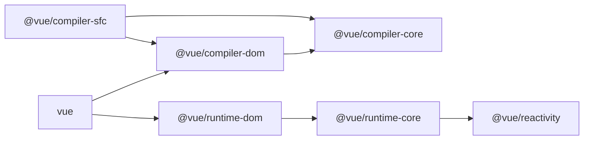

# mini-vue

## vue3 结构

- 处理编译
  - `@vue/compiler-sfc`  将单文件组件编译成 js
  - `@vue/compiler-dom`  依赖 `compiler-core`，用于处理 template，将其转换为 render 函数
  - `@vue/compiler-core`  
- 处理运行时
  - `@vue/runtime-dom`  专门处理 dom 节点上的东西
  - `@vue/runtime-core`  核心运行时
  - `@vue/reactivity`  实现响应式

